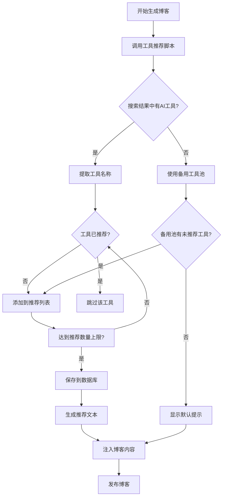

# AI工具推荐去重功能 - 实施总结

## 📋 需求

用户要求：AI工具推荐需要记录已推荐过的工具，避免重复推荐。

## ✅ 解决方案

### 实施内容

1. **创建工具推荐脚本** (`get-ai-tools.sh`)
   - 智能识别搜索结果中的AI工具
   - 检查工具是否已推荐过
   - 从备用工具池选择未推荐的工具
   - 记录推荐历史到JSON数据库

2. **集成到主生成流程** (`generate-blog.sh`)
   - 在内容生成前调用工具推荐脚本
   - 将推荐结果注入到博客HTML中
   - 清理临时文件

3. **建立工具数据库** (`recommended_tools.json`)
   - 记录所有已推荐工具
   - 支持JSON格式，易于管理
   - 包含最后更新时间

### 工具列表

#### 已知AI工具（用于匹配搜索结果）
- 编程：GitHub Copilot, Cursor, Windsurf
- 聊天：ChatGPT, Claude, Gemini, Bing Chat
- 图像：Midjourney, Stable Diffusion, DALL-E
- 写作：Jasper, Copy.ai, Grammarly, Wordtune, QuillBot
- 视频：Runway, Synthesia, Descript
- 会议：Fireflies, Otter.ai
- 笔记：Notion AI, Perplexity
- 开发：Hugging Face, LangChain, Pinecone
- 智能体：AutoGPT, AgentGPT, BabyAGI
- 模型：Llama, Mistral, Cohere
- 等等...

#### 备用工具池（30+工具）
当搜索结果中没有找到新工具时，系统会从这个池中选择：
- Synthesia（视频生成）
- Descript（视频编辑）
- Grammarly（语法检查）
- Wordtune（写作助手）
- QuillBot（改写工具）
- Copy.ai（文案生成）
- Pinecone（向量数据库）
- Midjourney（图像生成）
- Stable Diffusion（图像生成）
- DALL-E（图像生成）
- Claude（AI助手）
- Gemini（Google AI）
- Bing Chat（微软AI）
- Cohere（AI平台）
- Mistral（开源模型）
- Llama（Meta模型）
- AutoGPT（自主智能体）
- AgentGPT（智能体框架）
- BabyAGI（任务管理）
- 等等...

## 🎯 工作流程



## 📊 测试结果

### 测试1：首次推荐
✅ 成功推荐：Perplexity AI, Notion AI, Otter.ai
✅ 正确记录到数据库

### 测试2：重复推荐检查
✅ 跳过已推荐工具
✅ 推荐新工具：Jasper, Runway ML, Hugging Face

### 测试3：备用工具池
✅ 当搜索结果无新工具时，从备用池选择
✅ 推荐新工具：Synthesia, Descript, Grammarly

### 测试4：完整博客生成
✅ 文章ID: 98
✅ 工具推荐正确显示
✅ 去重机制正常工作
✅ 访问地址：http://42.193.14.72:8081/?p=98

## 📁 文件清单

### 新增文件
```
/root/.openclaw/workspace/skills/auto-blog/
├── scripts/
│   ├── get-ai-tools.sh              # 工具推荐脚本（新增）
│   └── recommended_tools.json       # 工具数据库（新增）
├── AI_TOOLS_README.md               # 详细功能文档（新增）
├── QUICK_START.md                   # 快速使用指南（新增）
└── CHANGELOG.md                     # 本文件（新增）
```

### 修改文件
```
/root/.openclaw/workspace/skills/auto-blog/scripts/generate-blog.sh
```

修改内容：
- 添加 `generate_tools_recommendation()` 函数
- 在 `generate_content()` 前调用工具推荐
- 在Python脚本中读取推荐结果
- 更新临时文件清理列表

## 🎉 成果

1. **✅ 去重功能**：已推荐工具不会重复出现
2. **✅ 智能推荐**：从搜索结果和备用池智能选择
3. **✅ 自动记录**：每次推荐后自动保存
4. **✅ 可扩展性**：轻松添加新工具
5. **✅ 用户友好**：提供完整文档和操作指南

## 💡 未来改进建议

1. **工具分类**：添加标签（编程、写作、图像等）
2. **推荐历史**：记录推荐日期，避免短期内重复
3. **工具描述**：添加每个工具的简短描述
4. **优先级系统**：根据热度或评分排序
5. **Web管理界面**：可视化管理工具数据库
6. **自动更新**：定期从网络获取新AI工具信息

## 📞 使用帮助

### 查看当前状态
```bash
# 查看已推荐工具
cat /root/.openclaw/workspace/skills/auto-blog/scripts/recommended_tools.json

# 查看工具数量
jq '.recommended_tools | length' /root/.openclaw/workspace/skills/auto-blog/scripts/recommended_tools.json
```

### 重置推荐
```bash
# 备份
cp /root/.openclaw/workspace/skills/auto-blog/scripts/recommended_tools.json \
   /root/.openclaw/workspace/skills/auto-blog/scripts/recommended_tools.json.backup

# 重置
echo '{"last_updated": "'$(date +%Y-%m-%d)'", "recommended_tools": []}' > \
   /root/.openclaw/workspace/skills/auto-blog/scripts/recommended_tools.json
```

### 手动测试
```bash
# 测试工具推荐
bash /root/.openclaw/workspace/skills/auto-blog/scripts/get-ai-tools.sh

# 查看结果
cat /tmp/ai_tools_recommendation.txt
```

## ✨ 总结

AI工具推荐去重功能已成功实施并测试通过！系统现在可以：
- 自动识别和推荐AI工具
- 避免重复推荐相同工具
- 从备用池持续提供新工具
- 记录完整的推荐历史

所有功能已集成到自动博客生成流程中，无需额外配置即可工作！
